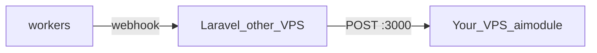

# Your side — aimodule VPS setup

You run aimodule on **this VPS**. Laravel runs on **another server** and calls your API on port **3000**. Workers send results to Laravel's webhook URL.

Laravel handoff doc: [LARAVEL.md](LARAVEL.md)  
Full technical reference: [INTEGRATION.md](INTEGRATION.md)

---

## What runs on your VPS

| Service | Port | Exposed? |
|---------|------|----------|
| **aimodule** (API) | 3000 | **Yes** — Laravel calls this |
| aimodule-worker ×2 | — | No |
| valkey (queue/cache) | 6379 | **No** — never expose |
| test-backend | 3001 | No (dev only) |
| web | 80 | Dev tester UI only |



---

## What you update in `.env`

Edit root `.env` on the VPS (copy from `.env.sample` if needed):

```env
# Expose aimodule API on host port 3000
AIMODULE_PORT=3000

# Point webhooks to Laravel (NOT test-backend in production)
WEBHOOK_URL=https://api.theirdomain.com/api/webhooks/extraction-complete

# MUST match Laravel .env exactly
JWT_SECRET=your-strong-random-secret
WEBHOOK_SECRET=your-strong-random-webhook-secret

# Gemini, GCS, etc. — unchanged
GEMINI_API_KEY=...
```

| Variable | What to set |
|----------|-------------|
| `AIMODULE_PORT` | `3000` (default) — Laravel uses `http://<your-vps-ip>:3000` |
| `WEBHOOK_URL` | Laravel's **public HTTPS** webhook URL |
| `JWT_SECRET` | Share same value with Laravel team |
| `WEBHOOK_SECRET` | Share same value with Laravel team |

**Do not** put Laravel's URL as localhost — workers inside Docker must reach Laravel over the internet.

---

## What changed in `docker-compose.yml`

Already configured in repo:

1. **aimodule port published:**
   ```yaml
   ports:
     - "${AIMODULE_PORT:-3000}:3000"
   ```

2. **WEBHOOK_URL from `.env`** (not hardcoded to test-backend):
   ```yaml
   WEBHOOK_URL: ${WEBHOOK_URL:-http://test-backend:3001/api/webhook/extraction-complete}
   ```
   Applies to `aimodule` and both workers.

---

## Redeploy steps

```bash
cd /path/to/aicar
git pull

# Edit .env — set WEBHOOK_URL, secrets, AIMODULE_PORT
nano .env

docker compose up -d --build
docker compose ps
```

### Verify locally

```bash
curl http://localhost:3000/health
docker compose logs -f aimodule aimodule-worker
```

### Verify from Laravel server

Ask Laravel team to run:

```bash
curl http://<YOUR-VPS-IP>:3000/health
```

If this fails → check firewall (below).

---

## Firewall — allow Laravel IP only

Lock port 3000 to Laravel server's IP:

```bash
# Ubuntu UFW example — replace with Laravel server IP
ufw allow from 198.51.100.50 to any port 3000 proto tcp
ufw deny 3000
ufw reload
```

| Rule | Why |
|------|-----|
| Allow Laravel IP on 3000 | Only their server can call extract API |
| Deny everyone else on 3000 | Don't expose AI API to the world |
| Never open 6379 | Valkey must stay internal |

Optional: put Nginx + TLS in front (`https://ai-api.yourdomain.com` → `localhost:3000`).

---

## What to share with Laravel team

Send them [LARAVEL.md](LARAVEL.md) plus:

| Item | Example |
|------|---------|
| aimodule URL | `http://203.0.113.10:3000` |
| `JWT_SECRET` | (same as your `.env`) |
| `WEBHOOK_SECRET` | (same as your `.env`) |
| Their webhook URL | They give you → you put in `WEBHOOK_URL` |

They must give you their webhook URL **before** you set `WEBHOOK_URL` and redeploy.

---

## Webhook flow (your side)

1. Laravel calls `POST http://<your-ip>:3000/api/v1/documents/extract`
2. aimodule enqueues job → workers process PDF (1–3 min)
3. Worker POSTs to `WEBHOOK_URL` (Laravel's URL from your `.env`)
4. aimodule retries webhook 3× if Laravel doesn't return 200

**You do not build the webhook** — Laravel does. You only set `WEBHOOK_URL` correctly.

Large workshop results (>50 KB) are gzip-compressed. Laravel must gunzip before HMAC verify (documented in LARAVEL.md).

---

## Dev vs production

| Mode | `WEBHOOK_URL` | Who uses port 3000 |
|------|---------------|-------------------|
| **Dev** (test portal) | `http://test-backend:3001/api/webhook/extraction-complete` | Optional — mostly internal |
| **Production** (Laravel) | `https://api.theirdomain.com/api/webhooks/extraction-complete` | Laravel server IP only |

You can keep `test-backend` + `web` for your own testing, or stop them in production:

```bash
docker compose stop test-backend web
```

---

## Scaling workers

More parallel PDF processing → add worker replicas in `docker-compose.yml`:

```yaml
aimodule-worker-3:
  <<: *aimodule-worker
```

Then `docker compose up -d --scale aimodule-worker=3` or add named replicas.

---

## Cache note

After big aimodule code updates, flush extraction cache if testing:

```bash
docker compose exec valkey valkey-cli FLUSHDB
```

Or wait for TTL (`RESULT_CACHE_TTL_SECONDS`, default 24h).

---

## Checklist before go-live

- [ ] `git pull` + `docker compose up -d --build`
- [ ] `curl http://localhost:3000/health` OK
- [ ] `WEBHOOK_URL` = Laravel HTTPS webhook (not test-backend)
- [ ] `JWT_SECRET` + `WEBHOOK_SECRET` shared with Laravel
- [ ] Firewall: port 3000 open only for Laravel IP
- [ ] Laravel confirmed `curl http://<your-ip>:3000/health` works
- [ ] Test PDF URL is public HTTPS (aimodule workers download it)
- [ ] Sent [LARAVEL.md](LARAVEL.md) to Laravel team

---

## Troubleshooting

| Problem | Fix |
|---------|-----|
| Laravel can't reach :3000 | Open firewall for their IP; check `AIMODULE_PORT` |
| Webhook never arrives | Wrong `WEBHOOK_URL`; Laravel URL not HTTPS/public; check worker logs |
| Webhook signature fails on Laravel | `WEBHOOK_SECRET` mismatch; Laravel verifying compressed body |
| Wrong extraction cached | `docker compose exec valkey valkey-cli FLUSHDB` |
| Queue stuck | `docker compose logs aimodule-worker`; check `GEMINI_API_KEY` |
